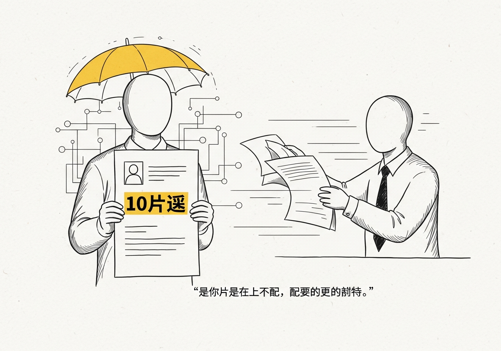
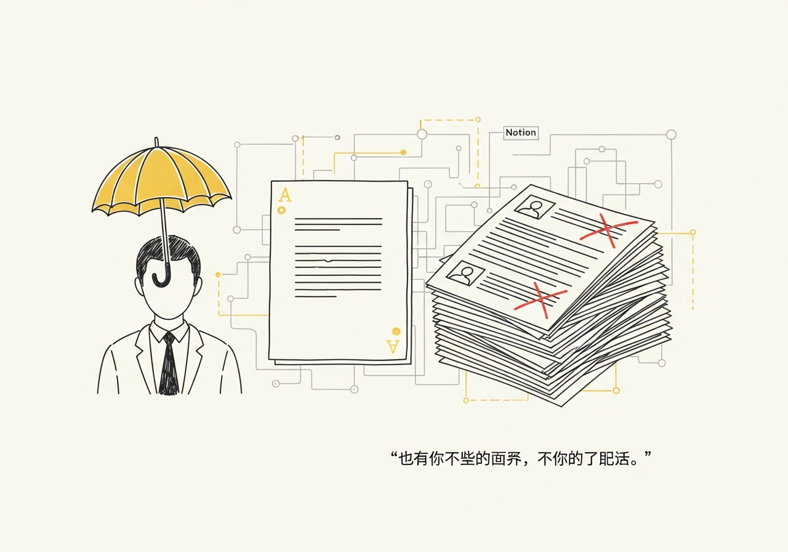
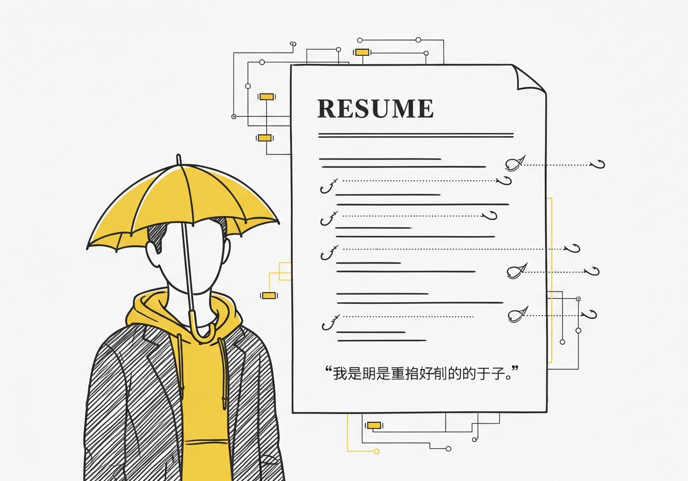

# 求职系列（1）：如何准备一份让面试官想面你的简历

先说说我的背景：我是在职的大厂工程师，从实习、校招到社招，累计面试超过上百场。给几十位同学做过模拟面试和求职辅导，现在在牛客上还能搜到我的号。校招时拿下了多个大厂的 offer，最近在看新机会，通过面试率也超过 90%。

这些数字不是用来装的，是用来告诉你：接下来说的东西，全都是亲身总结出来的真本事，放在别人那里是可以拿去卖课的。

最近又到了春招和暑期实习招聘季，有不少同学找我咨询简历和面试的问题。

同样的话我重复说了太多遍，决定把整套求职心得整理出来开源，帮到更多的人。

这是求职系列的第一篇，聊聊简历。

## 简历的本质

很多人把简历当成个人信息登记表来写。教育经历、工作经历、技能列表，从上到下老老实实填一遍。

但你想想，面试官看一份简历平均花多少时间？**10秒。**

10秒，他要决定你值不值得聊。你的简历不是一份档案，**它是一份销售文案。** 它唯一的目的就是在10秒内让面试官得出一个结论：这个人好像很厉害，我想见见。

所有的技巧都围绕这一个目标展开。

## 1️⃣ 只能有一页

这条没有商量余地。

不管你有多少年经验，不管你做过多少项目，简历只能有一页。超过一页的简历，面试官大概率不会翻到第二页。

一页纸的限制会逼你做一件极其重要的事：**筛选**。你不得不砍掉那些可有可无的内容，只留下最能证明你价值的部分。这个筛选过程本身，就已经在帮你梳理自己的核心竞争力了。

如果你觉得一页放不下，说明你还没想清楚自己最值钱的东西是什么。

## 2️⃣ 一行一句话，一句话一行

这是排版层面最重要的原则。

每一个 bullet point 只写一句话，这句话不换行，在一行内说完。面试官扫简历是跳着看的，如果一个要点写了三行，他大概率只看第一行的前半段就跳过了。

一行一句话还有一个好处：**强迫你精简表达。** 如果一句话说不完，说明你要么没提炼出重点，要么塞了太多细节。

## 3️⃣ 最亮的点放在最前面

大部分人写简历按时间倒序：最近的工作排第一，然后依次往前。

这在大多数情况下没问题。但如果你有一个特别亮眼的经历，哪怕它发生在三年前，**打破时间顺序，把它放到最前面。**

面试官的注意力在前5秒最集中。前5秒他看到了什么，决定了后面5秒他是继续看还是扔掉。你最强的武器必须第一时间亮出来。

比如你大二做过一个开源项目拿了几百个 star，但后来的实习经历平平。那就把那个开源项目提到工作经历前面。规则是死的，**说服力是活的。**

## 4️⃣ 量化一切，遵循 STAR 法则

每段经历都用 STAR 来组织：

- **S**ituation：什么背景
- **T**ask：你负责什么
- **A**ction：你做了什么
- **R**esult：结果如何，用数字说话

坏的写法：负责服务端性能优化，提升了系统性能。

好的写法：主导核心接口性能优化，P99 延迟从 800ms 降至 120ms，QPS 提升 5 倍，直接支撑了双十一 10 万级并发。

同样一件事，第二种写法的信息密度和说服力碾压第一种。**没有数字的经历，在面试官眼里就是空气。**

每段经历的 bullet point 控制在 3-5 个，最多不超过 10 个。太多了面试官不会看，太少了显得没做什么事。

## 5️⃣ 不要堆技能列表

很多人简历上专门有一栏 Skill Set，列了一排技术名词：Java、Python、MySQL、Redis、Kafka、Docker、Kubernetes……

面试官看到这种列表的反应是：**所以呢？**

列了20个技术名词，我不知道你哪个精通哪个只是了解，不知道你在实际项目中怎么用的，不知道你解决了什么问题。这就是一堆没有上下文的关键词，毫无说服力。

更好的做法是**让项目经历来证明你的技能**。你写了一个高并发系统用了 Redis 做缓存、Kafka 做异步解耦，面试官自然知道你会这些。而且他知道你不是停留在知道的层面，你是真正用过、解决过问题的。

技能列表可以保留，但只作为补充，不要指望它帮你加分。

## 6️⃣ 不要写空话，要有论据

简历里最常见的废话：

- 自驱力强
- 学习能力强
- 团队协作好
- 责任心强

面试官每天看几十份简历，每一份都写着这些。你写了和没写一样。

**空洞的形容词没有任何信息量。** 你说自驱力强，凭什么让我相信？

加上论据：自驱力强，半年减重 50 斤。自驱力强，非科班出身自学编程拿到大厂 offer。自驱力强，工作之余坚持技术博客输出，累计阅读量 15 万+。

一个具体的事实胜过一百个形容词。

## 7️⃣ 埋钩子

简历上不要把一件事说得太详细。**留白，让面试官好奇。**

比如你写：主导 XX 平台架构设计，上线一周用户数突破 1000+。

面试官看到这行，自然会想：怎么做到的？架构怎么设计的？遇到了什么挑战？

这个好奇心会驱动他在面试时主动问你这个问题。而这个问题，恰恰是你最擅长回答的，因为你做过。

**好的简历是一个钩子矩阵。** 每一行都在埋一个问题，每个问题你都有准备好的深度回答。你在用简历引导面试官走你的剧本。

## 8️⃣ 实事求是

这一条听起来很基本，但很多人做不到。

有些人为了让简历好看，把别人做的事写成自己做的，把参与写成主导，把了解写成精通。

短期内可能骗过简历筛选，但面试官一问就穿帮。你说你主导了一个系统的架构设计，面试官问你为什么选 A 方案而不是 B 方案，你答不上来。当场社死。

**实事求是不是软弱，是自信。** 做得好的地方大方展示，做得不够好的地方也坦然面对。面试官更看重的是你的思考过程和成长潜力，而不是你是不是每件事都做到了完美。

一个项目的 well done 和 bad done 都说出来，反而体现你有复盘意识和自我认知。

## 9️⃣ 个人总结怎么写

很多简历的自我评价写得像小学生作文：热爱技术、积极向上、吃苦耐劳。这种话跟没写一样。

**个人总结只写三句话：**

1. 第一句：你在行业或专业上取得的结果。比如大厂 T7 工程师，开源项目 500+ star，某个方向的技术专家。用事实建立第一印象。

2. 第二句：你是一个什么样的人，带论据。比如坚持每天阅读一小时，累计阅读时长 500 小时以上。比如投资年化收益 30%+，具备独立的判断力和风险管理能力。

3. 第三句：你想成为什么样的人。这句表达你的方向感和成长诉求。比如希望在 AI Agent 方向深耕，成为该领域的核心开发者。

三句话，**过去、现在、未来**。面试官 10 秒扫完就能对你形成一个清晰的画像。

## 最后

把你的简历拿出来，对照上面的每一条检查一遍。

- 超过一页了吗？砍。
- 有没有量化？没有数字的经历，删掉或者补上数字。
- 有没有空话？每一句自我评价都问自己：我有论据吗？
- 最亮的点在哪？它是不是在简历的第一屏？

简历不是写给自己看的。它是你递给面试官的一张名片，只有 10 秒的生命。

**在这 10 秒内，让他觉得你值得花 45 分钟来聊。**

这就够了。
